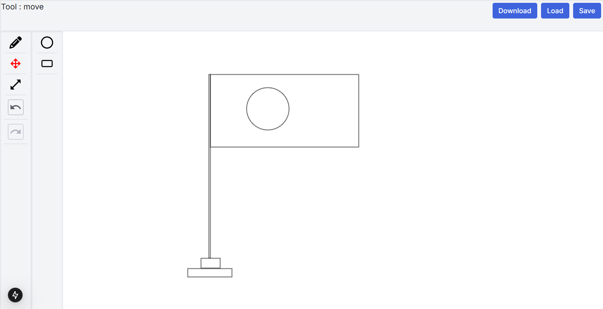

# Next Paint 🎨


Next Paint is a simple web-based drawing application that allows users to create, move, and resize shapes, save designs to LocalStorage, and export the canvas as a PNG file.

## 🚀 Features

### ✅ Minimum Requirements

- **Pre-built Shapes**: Supports built-in shapes like rectangles and circles.
- **Drag & Resize**: Move and resize shapes freely.
- **Save & Load Designs**: Store designs in LocalStorage and reload them later.
- **Download Design**: Export the canvas as a PNG file.

### 🎉 Extras

- **Undo/Redo**: Basic action history management.
- **Transparent Card Effect**: Apply a blurred transparent effect to the background of the canvas.

## 📦 Installation & Setup

### 📌 Prerequisites

- **Required Node.js version**: `20.18.x`

### 📥 Clone the Repository

```sh
git clone https://github.com/zhbdripon/next-paint.git
```

### 📂 Navigate to Project Root

```sh
cd next-paint
```

### 📦 Install Dependencies

```sh
npm install
```

### ▶️ Run the Project

```sh
npm run dev
```

The project will be available at `http://localhost:3000/` by default.

## 🤝 Contributing

Feel free to fork the repository and submit pull requests to improve the project!

## 📜 License

This project is licensed under the MIT License.

---

Happy Coding! 🎨✨

